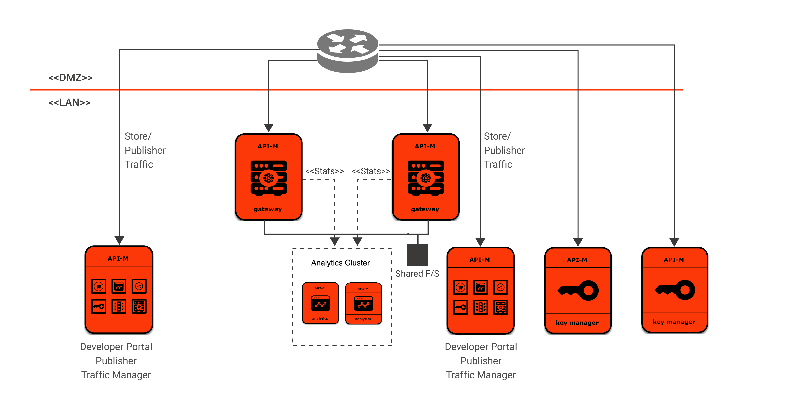

# Customize WSO2 Ansible resources to deploy API Manager Pattern 2

This document provides instructions to customize the WSO2 API Manager Ansible resources in order to deploy API Manager Pattern 2.



## Packs to be Copied

Copy the following files to `files` directory.

1. [WSO2 API Manager package](https://wso2.com/api-management/install/)
2. [WSO2 API Manager Analytics package](https://wso2.com/api-management/install/analytics/)
3. [MySQL Connector/J](https://dev.mysql.com/downloads/connector/j/5.1.html)

## Customize the WSO2 Ansible scripts

The followings are the roles needed to deploy API Manager pattern 2.

- apim
- apim-gateway
- apim-km
- apim-analytics-worker

### 1. The [inventory-apim](../dev/inventory-apim) file use to provision the API Keymanager, Gateway and APIM instances. 

```
[apim]
HOST ansible_host=localhost ansible_user=centos ansible_connection=local

```

### 2. The  [site.yml](../site.yml) file use to maintain the product roles. 

```
- name: Apply common configuration to all nodes
  hosts: all
  roles:
    - common

- name: Apply APIM Gateway profile configuration to an apim node
  hosts:
    - apim-gateway_1
  roles:
    - apim-gateway

- name: Apply APIM Keymanager profile configuration to an apim node
  hosts:
    - apim-km_1
  roles:
    - apim-km

- name: Apply APIM Traffic Manager,Pubstore and Publisher profile configuration to an apim node
  hosts:
    - apim_1
  roles:
    - apim

- name: Apply APIM Analytics Dashboard configuration to an apim node
  hosts:
    - apim-analytics-dashboard_1
  roles:
    - apim-analytics-dashboard

- name: Apply APIM Analytics Worker default configuration to an apim node
  hosts:
    - apim-analytics-worker_1
  roles:
    - apim-analytics-worker
```

### 3. Customize the roles for API Manager pattern 2

```
.
└── dev
    ├── group_vars
    │   ├── apim-analytics.yml
    │   └── apim.yml
    ├── host_vars
    │   ├── apim_1.yml
    │   ├── apim-analytics-worker_1.yml
    │   ├── apim-analytics-dashboard_1.yml
    │   ├── apim-gateway_1.yml
    │   ├── apim-km_1.yml
    └── inventory-apim
    └── inventory-analytics

```
API Manager pattern 2 contains 4 groups and the configurations specific for each group should be in the respective yaml file under [group_vars](../dev/group_vars) folder. Configurations specific to each host should be added to the corresponding yaml file under [host_vars](../dev/host_vars) folder.

Most commonly changed values are parameterized in the above files. If further changes are required, the values should be parameterized and added to the files accordingly.

#### i. Customize `apim` role

Navigate to [carbon-home](../roles/apim/templates/carbon-home) of the `apim` role. All the files required to deploy the API Manager Pub-Store-TM combination are here. Follow the instructions in the following documents to modify the files.
- [APIM](https://apim.docs.wso2.com/en/latest/install-and-setup/setup/distributed-deployment/deploying-wso2-api-m-in-a-distributed-setup/#step-5-configure-api-m-analytics)

#### ii. Customize `apim-gateway` role

Navigate to [carbon-home](../roles/apim-gateway/templates/carbon-home) of the `apim-gateway` role. Follow the instructions in the [document](https://apim.docs.wso2.com/en/latest/install-and-setup/setup/distributed-deployment/deploying-wso2-api-m-in-a-distributed-setup/#step-5-configure-api-m-analytics) and modify the files.

> NOTE: The guideline to configure both internal and external gateways are the same. But as these gateways are in different networks and have different configurations.

#### iii. Customize `apim-km` role

Navigate to [carbon-home](../roles/apim-km/templates/carbon-home) of the `apim-km` role. Follow the instructions in the [document](https://apim.docs.wso2.com/en/latest/install-and-setup/setup/distributed-deployment/deploying-wso2-api-m-in-a-distributed-setup/#step-5-configure-api-m-analytics) and modify the files.

#### iv. Customize `apim-analytics-worker` role

Navigate to [carbon-home](../roles/apim-analytics-worker/templates/carbon-home) of the `apim-analytics-worker` role. All the files required to deploy the API Manager analytics are here. Follow the instructions in the following files to modify the files.
- [Configure Analytics](https://apim.docs.wso2.com/en/latest/install-and-setup/setup/distributed-deployment/deploying-wso2-api-m-in-a-distributed-setup/#step-5-configure-api-m-analytics)

### 4. Further customization

Uncomment the following line in `main.yml` under the role you want to customize and add the necessary changes.
```
- import_tasks: custom.yml
```